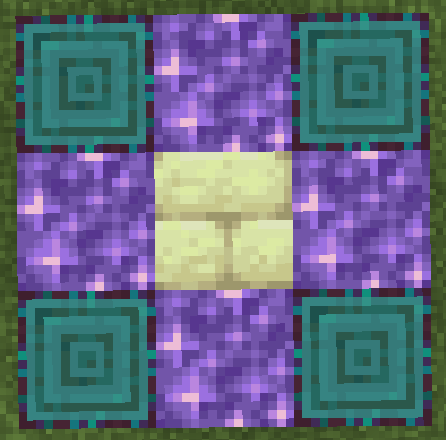

# Nightfall
A custom Minecraft datapack that adds new difficulty. Made for 1.21.

During nighttime, extra mobs will spawn that are scaled to your point in progression in the game.

## Installation

1. Insert this folder in your world's datapack folder to apply the datapack.
2. Set the difficulty to hard!
3. Change the suggested gamerules below for the intended experience in multiplayer.

## Suggested GameRule Changes

- forgiveDeadPlayers = False >> Mobs will not de-aggro upon your death.
- universalAnger = True >> Mobs that are aggro'd aggro everyone.

## Changes from this Datapack

- Removes the ability to craft beds
- Removes the generation of villages and igloo structures
- Bows are now crafted with short_grass instead of string. Remember that short_grass can be obtained via shears.
- Crossbows are also crafted with short_grass instead of string.
- Arrow's recipe is now a cobblestone, stick, and short grass, in descending order. Crafts 2 instead of 4.
- Gravel gives any entity on top of it speed 1. This speed is removed after stepping off of it.
- Adds a scaling difficulty that increases each night and via various advancements. (note: spawns from this pack BYPASS normal spawn conditions.)
- Beware of full moons.
- Adds a custom altar that can be built. Prepare for a fight, and get rich.

## The Altar

The image below shows how to build it. Stand in the center and hold a netherite ingot to activate it. (it might be a little destructive)

***The Altar was balanced around maxed out endgame gear in hard difficulty.***

SPOILER WARNING: What does the Altar do? 

- Stop normal datapack mob spawns during the following night.
- Enable mob griefing during the following night.
- ***Spawn extraordinarily difficult enemies throughout the following night.***
- Reward you relative to your combat performance at the end of the following night.

## How to use the datapack's custom commands

Most of the pack is automated. However some functions of the datapack are only called manually.

- /function nightfall:setlobby >> creates a lobby, setting a worldborder and forces all players into adventure mode.
- /function nightfall:removelobby >> expands the border to 20k and sets all players into survival mode.
- /function nightfall:reset >> removes all scoreboard objectives to simulate a fresh boot of the pack.
- /function nightfall:setdays >> sets the scoreboard value of how many days have elapsed. changes the scaled difficulty of all players directly. Recommended to only change in intervals of 8 to keep the full moons accurate.
